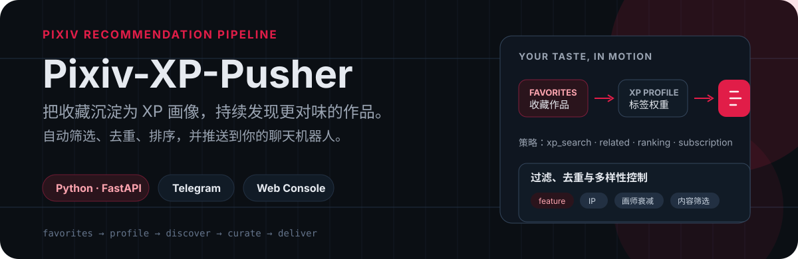
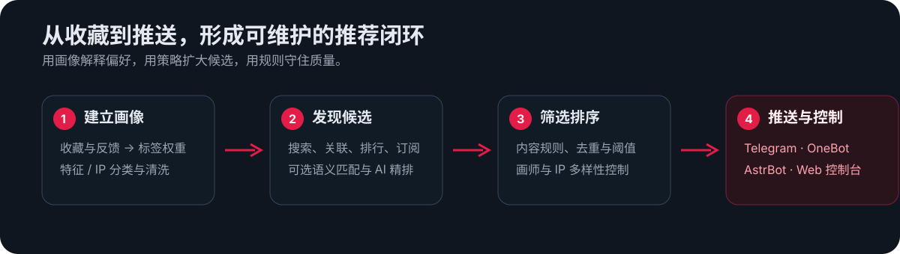

<p align="center">
  
</p>

<p align="center">
  <a href="./LICENSE">MIT License</a> · <a href="./docs/quickstart.md">快速上手</a> · <a href="./docs/configuration.md">配置说明</a> · <a href="./docs/telegram_commands.md">Telegram 指令</a>
</p>

> 一个基于 Pixiv 收藏构建兴趣画像的个人推荐与推送工具：从多种来源发现候选作品，经过可配置的过滤、去重和多样性控制后，发送到 Telegram、OneBot 或 AstrBot。

这是 [bwwq/Pixiv-XP-Pusher](https://github.com/bwwq/Pixiv-XP-Pusher) 的 fork / 增强版。它保留原项目的基础推荐与部署流程，并补充 Web 管理、标签分类、推荐多样性、数据库维护、推荐效果评估及 Telegram Rich Message 等能力。

## 看点

- **从收藏学习偏好**：统计标签权重，支持时间衰减、停用词、探索率与标签分类。
- **不只搜同一类图**：同时使用 XP 搜索、关联作品、排行榜和画师订阅发现候选。
- **让每次推送更干净**：按收藏数、R-18、AI 作品、动图、黑名单等规则过滤，并提供画师 / IP 多样性控制。
- **按需增强，不强依赖 AI**：可选 LLM 标签清洗、同义词合并、Embedding 语义匹配与 AI 精排；不配置 API Key 时仍可用纯统计模式运行。
- **保持可操作**：提供 Web 控制台、Telegram 交互菜单，以及数据库维护、效果评估和 systemd 运维工具。

<p align="center">
  
</p>

## 5 分钟跑通一次推送

下面以本地运行方式为例；Docker 部署请看[下一节](#docker-compose-部署)。

```bash
git clone https://github.com/beckyeeky/Pixiv-XP-Pusher.git
cd Pixiv-XP-Pusher
python -m venv .venv
source .venv/bin/activate  # Windows: .venv\Scripts\activate
pip install -r requirements.txt
cp config.example.yaml config.yaml
```

编辑 `config.yaml`，至少填写：

- `pixiv.refresh_token`
- `notifier.types`
- 对应通知器的必填字段；例如 Telegram 的 `bot_token`、`chat_ids`、`allowed_users`

获取或更新 Pixiv refresh token：

```bash
python get_token.py
```

先执行一次验证，再启动常驻调度：

```bash
python main.py --once
python main.py --now
```

默认 Web 控制台地址为 `http://127.0.0.1:8000`，可单独启动：

```bash
python -m uvicorn web.app:app --host 0.0.0.0 --port 8000
```

Windows 也可以运行 `start.bat`，或使用交互式引导：

```bash
python launcher.py
```

## Docker Compose 部署

适合 VPS 或长期运行的机器。准备好 `config.yaml` 后：

```bash
docker-compose up -d --build
docker-compose logs -f pusher
docker-compose logs -f web
```

也可以使用部署脚本：

```bash
chmod +x deploy.sh
./deploy.sh start
./deploy.sh logs
```

## 推荐是怎样形成的

| 阶段 | 实际工作 |
| --- | --- |
| 建立画像 | 从收藏中统计标签偏好，按 `feature` 与 `ip` 等类别组织标签，让视觉特征优先参与匹配与展示。 |
| 发现候选 | `xp_search` 组合画像标签搜索；`related` 延展已推送或已喜欢作品；`ranking` 筛选榜单；`subscription` 跟进画师更新。 |
| 筛选排序 | 过滤内容类型与黑名单，去重，并通过同画师 / 同 IP 衰减避免连续刷屏。 |
| 送达与反馈 | 推送到 Telegram、OneBot 或 AstrBot；通过 Web 控制台和 Telegram 菜单查看状态、管理配置与调整任务。 |

## 配置入口

从 `config.example.yaml` 复制出的 `config.yaml` 是唯一配置入口。下面是一份最小结构示例：

```yaml
pixiv:
  refresh_token: "YOUR_PIXIV_REFRESH_TOKEN"
  sync_token: ""
  user_id: 0

strategies:
  - xp_search
  - related
  - ranking
  - subscription

notifier:
  types: [telegram]
  telegram:
    bot_token: "YOUR_TELEGRAM_BOT_TOKEN"
    chat_ids: [123456789]
    allowed_users: [123456789]

web:
  enabled: true
  require_login_password: true
  password: "YOUR_WEB_PASSWORD"
  port: 8000
```

常用的推荐质量开关：

```yaml
tag_classifier:
  enabled: true

filter:
  daily_limit: 20
  r18_mode: "mixed"      # mixed / r18_only / safe
  exclude_ai: false
  skip_ugoira: true
  display_tags:
    max_ip_count: 2
  author_diversity:
    enabled: true
  ip_diversity:
    enabled: true
```

完整字段与示例见 [config.example.yaml](config.example.yaml) 和 [配置文档](docs/configuration.md)。

## 操作面板

**Web 控制台**提供 Dashboard、Settings、Tags、Gallery 与 Import / Export：查看推送概览和 XP 标签、管理配置与权重、浏览推送历史、导入导出配置。公开部署时，请开启 `web.require_login_password` 并设置强密码。

**Telegram Bot** 可使用：

| 指令 | 用途 |
| --- | --- |
| `/start`, `/menu` | 打开控制面板 |
| `/push`, `/push <ID>` | 进入推送向导或推送指定作品 |
| `/search` | 交互式搜索 |
| `/xp`, `/stats`, `/status` | 查看画像、策略成功率与系统状态 |
| `/schedule` | 查看或修改计划时间 |
| `/block`, `/unblock`, `/mute`, `/unmute` | 管理标签过滤与静音 |
| `/block_artist`, `/unblock_artist` | 管理画师黑名单 |
| `/batch`, `/rich` | 设置批量模式与 Rich Message 模式 |
| `/menu` → `🏷️ 标签审核` | 查看待审核标签，按流程触发批量判定 |
| `/restart` | 通过 systemd 同时重启推送服务与 WebUI |

命令细节与实际菜单文案见 [Telegram 指令文档](docs/telegram_commands.md)；以当前 Bot 的 `/help` 为准。

## 日常命令与维护

```bash
# 查看帮助 / 立即执行一次 / 启动后先立即执行一次
python main.py --help
python main.py --once
python main.py --now

# 重置 XP 画像缓存 / 快速测试 / 使用指定配置
python main.py --reset-xp
python main.py --test
python main.py --config ./config.yaml

# 数据库概览、备份与清理
python scripts/db_maintenance.py overview
python scripts/db_maintenance.py backup --output ./backup/pixiv_xp.db
python scripts/db_maintenance.py cleanup --days 180

# 推荐效果评估
python scripts/evaluate_recommendation.py
python scripts/evaluate_recommendation.py --json
```

同步 Danbooru IP 标签：

```bash
export DANBOORU_LOGIN=your_login
export DANBOORU_API_KEY=your_api_key
python scripts/sync_ip_tags.py
```

Docker 的常用生命周期命令：

```bash
docker-compose restart
docker-compose down
```

systemd 示例、诊断和更多维护流程见 [运维文档](docs/operations.md)。

## 常见问题

<details>
<summary><strong>Telegram 连不上怎么办？</strong></summary>

国内网络通常需要代理；在 Telegram 配置中填写：

```yaml
notifier:
  telegram:
    proxy_url: "http://127.0.0.1:7890"
```
</details>

<details>
<summary><strong>点击 Bot 按钮提示无权限？</strong></summary>

将自己的 Telegram User ID 加入 `notifier.telegram.allowed_users`：

```yaml
notifier:
  telegram:
    allowed_users: [123456789]
```
</details>

<details>
<summary><strong>不想使用 AI 可以吗？</strong></summary>

可以。关闭 `tag_mapping.enabled`、`ai.embedding.enabled`、`ai.scorer.enabled` 和 `tag_classifier.enabled` 后，项目仍会使用规则与统计方式运行。`tag_mapping` 只生成待人工审核的映射候选，不会直接改写画像。
</details>

<details>
<summary><strong>可以公开部署 Web 控制台吗？</strong></summary>

可以，但至少开启登录密码；更推荐部署在内网、反向代理认证后，或仅通过 SSH 隧道访问。
</details>

## 项目地图

```text
Pixiv-XP-Pusher/
├── main.py                 # 一次执行、调度、重置画像
├── config.example.yaml     # 配置模板
├── web/                    # FastAPI Web 控制台
├── notifier/               # Telegram / OneBot / AstrBot 通知器
├── scripts/                # 维护、评估与同步脚本
├── ops/                    # 运维脚本
├── docs/                   # 详细文档
└── tests/                  # 自动化测试
```

## 与原项目的关系

本仓库基于 [bwwq/Pixiv-XP-Pusher](https://github.com/bwwq/Pixiv-XP-Pusher) 继续开发，感谢原项目提供基础架构、推荐流程和部署思路。增强内容包括：更细的配置与文档拆分、Web 设置与历史画廊、feature / IP 标签分类、推荐多样性策略、Telegram Rich Message、数据库维护、推荐评估和更完整的测试覆盖。

## License

[MIT License](LICENSE)
